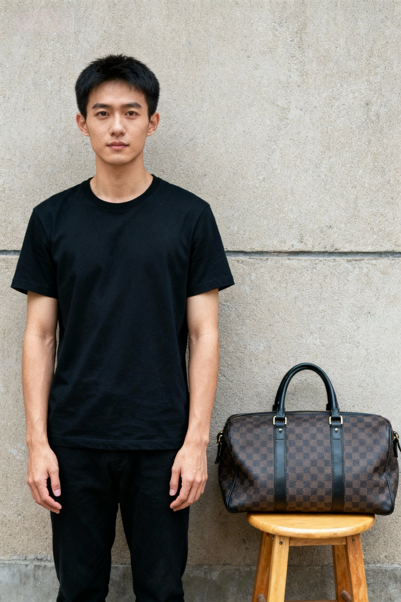

<div align="center">
   

# Making Avatars Interact <br> Towards Text-Driven Human-Object Interaction for Controllable Talking Avatars
<!-- # Towards Text-Driven Human-Object Interaction for Controllable Talking Avatars -->

</div>

**InteractAvatar** is a novel dual-stream DiT framework that enables talking avatars to perform **Grounded Human-Object Interaction (GHOI)**. Unlike previous methods restricted to simple gestures, our model can perceive the environment from a static reference image and generate complex, text-guided interactions with objects while maintaining high-fidelity lip synchronization.

<div align="center">
  <a href="https://github.com/angzong/InteractAvatar"></a> &ensp;
  <a href="https://interactavatar.github.io/"></a> &ensp;
  <a href="#"></a> &ensp;
  <a href="https://huggingface.co/youliang1233214/InteractAvatar"></a>
</div>

<br>


## 🔥🔥🔥 News!!

* **Jan 20, 2026**: 👋 We release the **InteractAvatar** paper and project page.
* **Jan 30, 2026**: 👋 We release the inference code.

## 📑 Open-source Plan

- [x] Paper and Project Page
- [ ] Inference code
- [ ] Pretrained Checkpoints (Initialised from Wan2.2-5B)
- [ ] **GroundedInter** Benchmark Data

## 📋 Table of Contents

- [🔥🔥🔥 News!!](#-news)
- [📖 Abstract](#-abstract)
- [🏗️ Model Architecture](#-model-architecture)
- [📊 Performance](#-performance)
- [🎬 Case Show](#-case-show)
- [📜 Requirements](#-requirements)
- [🛠️ Installation](#-installation)
- [🧱 Download Models](#-download-models)
- [🚀 Inference](#-inference)
- [📝 Citation](#-citation)
- [🙏 Acknowledgements](#-acknowledgements)

## 📖 Abstract

Generating talking avatars that can interact with their environment remains an open challenge. Existing methods often struggle with the **Control-Quality Dilemma**, failing to ground actions in the scene or losing video fidelity when complex motions are required.

**InteractAvatar** introduces a dual-stream framework that explicitly decouples perception planning from video synthesis:
*   **Perception and Interaction Module (PIM):** Handles environmental perception and motion planning (detection & motion generation) based on the reference image and text prompts.
*   **Audio-Interaction Aware Generation Module (AIM):** Synthesizes vivid talking avatars performing object interactions, guided by PIM via a novel Motion-to-Video (M2V) aligner.

**Key advantages:**
- ✅ **Grounded Interaction:** Perceives static scenes and interacts with specific objects (e.g., "Pick up the apple on the table").
- ✅ **Multimodal Control:** Supports any combination of **Text**, **Audio**, and **Motion** inputs.
- ✅ **Mult-Scene Control:** Generate avatars that can **Talk**, **Act**, and **Interact with Object** inputs.
- ✅ **High Fidelity:** Parallel co-generation ensures plausible video quality and precise lip-sync.

## 🏗️ Model Architecture


Our framework consists of two parallel DiT streams:
1.  **PIM (Planning Brain):** Takes the reference image and text prompt to generate a structural motion sequence (skeletal poses + object bounding boxes). It uses a "Perception as Generation" training strategy.
2.  **AIM (Rendering Engine):** Takes the audio, reference image, and the motion features from PIM (injected via the **M2V Aligner**) to generate the final video frames.

## 📊 Performance

We evaluate on our proposed **GroundedInter** benchmark (400 images, 100+ object types). InteractAvatar significantly outperforms SOTA methods (HuMo, VACE, Wan-S2V, etc.) in both interaction quality and video consistency.


<details>
<summary>📋 <strong>Click to see visual comparison (All Methods: 7 Columns)</strong></summary>
<br>

We compare **InteractAvatar** with Reference image and 6 other SOTA methods. 
<br>Note: <strong>Ours</strong> maintains the best consistency with the text prompt and reference image.

<table align="center" width="100%">
  <!-- ================= HEADER ================= -->
  <tr>
    <th width="14%">Ref</th>
    <th width="14%">Ours</th>
    <th width="14%">HY-Avatar</th>
    <th width="14%">HuMo</th>
    <th width="14%">Fantasy</th>
    <th width="14%">Wan-S2V</th>
    <th width="14%">OminiAvatar</th>
  </tr>

  <!-- ================= CASE 1: Handbag ================= -->
  <tr>
    <td colspan="7" style="padding: 10px 0; border-bottom: none;">
      <strong>Case 1 Prompt:</strong> One hand lifts the bag on the stool to the chest, while the other hand supports the bottom of the bag.
    </td>
  </tr>
  <tr>
    <td></td>
    <td><video src="videos/compare_videos/ours/608_inter_handbag_0_medium_01.mp4" width="100%" autoplay loop muted playsinline></video></td>
    <td><video src="videos/compare_videos/avatar/608_inter_handbag_0_medium_01.mp4" width="100%" autoplay loop muted playsinline></video></td>
    <td><video src="videos/compare_videos/humo/608_inter_handbag_0_medium_01.mp4" width="100%" autoplay loop muted playsinline></video></td>
    <td><video src="videos/compare_videos/fantacy/608_inter_handbag_0_medium_01.mp4" width="100%" autoplay loop muted playsinline></video></td>
    <td><video src="videos/compare_videos/s2v/608_inter_handbag_0_medium_01.mp4" width="100%" autoplay loop muted playsinline></video></td>
    <td><video src="videos/compare_videos/omni/608_inter_handbag_0_medium_01.mp4" width="100%" autoplay loop muted playsinline></video></td>
  </tr>

  <!-- ================= CASE 2: Rose ================= -->
  <tr>
    <td colspan="7" style="padding: 10px 0; border-bottom: none;">
      <strong>Case 2 Prompt:</strong> First gently holds the stem of the rose with one hand, then strokes the petals of the rose with the index and middle fingers of other hand.
    </td>
  </tr>
  <tr>
    <td></td>
    <td><video src="videos/compare_videos/ours/316_inter_rose_3_medium_02.mp4" width="100%" autoplay loop muted playsinline></video></td>
    <td><video src="videos/compare_videos/avatar/316_inter_rose_3_medium_02.mp4" width="100%" autoplay loop muted playsinline></video></td>
    <td><video src="videos/compare_videos/humo/316_inter_rose_3_medium_02.mp4" width="100%" autoplay loop muted playsinline></video></td>
    <td><video src="videos/compare_videos/fantacy/316_inter_rose_3_medium_02.mp4" width="100%" autoplay loop muted playsinline></video></td>
    <td><video src="videos/compare_videos/s2v/316_inter_rose_3_medium_02.mp4" width="100%" autoplay loop muted playsinline></video></td>
    <td><video src="videos/compare_videos/omni/316_inter_rose_3_medium_02.mp4" width="100%" autoplay loop muted playsinline></video></td>
  </tr>

  <!-- ================= CASE 3: Makeup ================= -->
  <tr>
    <td colspan="7" style="padding: 10px 0; border-bottom: none;">
      <strong>Case 3 Prompt:</strong> Holding a brush in right hand, with the bristles facing towards face, gently touching the cheek as you applies makeup to face.
    </td>
  </tr>
  <tr>
    <td></td>
    <td><video src="videos/compare_videos/ours/364_inter_makeup brush_0_medium_02.mp4" width="100%" autoplay loop muted playsinline></video></td>
    <td><video src="videos/compare_videos/avatar/364_inter_makeup brush_0_medium_02.mp4" width="100%" autoplay loop muted playsinline></video></td>
    <td><video src="videos/compare_videos/humo/364_inter_makeup brush_0_medium_02.mp4" width="100%" autoplay loop muted playsinline></video></td>
    <td><video src="videos/compare_videos/fantacy/364_inter_makeup brush_0_medium_02.mp4" width="100%" autoplay loop muted playsinline></video></td>
    <td><video src="videos/compare_videos/s2v/364_inter_makeup brush_0_medium_02.mp4" width="100%" autoplay loop muted playsinline></video></td>
    <td><video src="videos/compare_videos/omni/364_inter_makeup brush_0_medium_02.mp4" width="100%" autoplay loop muted playsinline></video></td>
  </tr>

  <!-- ================= CASE 4: Vase ================= -->
  <tr>
    <td colspan="7" style="padding: 10px 0; border-bottom: none;">
      <strong>Case 4 Prompt:</strong> First extend both hands to hold the vase, and then move it forward.
    </td>
  </tr>
  <tr>
    <td></td>
    <td><video src="videos/compare_videos/ours/501_inter_vase_1_medium_01.mp4" width="100%" autoplay loop muted playsinline></video></td>
    <td><video src="videos/compare_videos/avatar/501_inter_vase_1_medium_01.mp4" width="100%" autoplay loop muted playsinline></video></td>
    <td><video src="videos/compare_videos/humo/501_inter_vase_1_medium_01.mp4" width="100%" autoplay loop muted playsinline></video></td>
    <td><video src="videos/compare_videos/fantacy/501_inter_vase_1_medium_01.mp4" width="100%" autoplay loop muted playsinline></video></td>
    <td><video src="videos/compare_videos/s2v/501_inter_vase_1_medium_01.mp4" width="100%" autoplay loop muted playsinline></video></td>
    <td><video src="videos/compare_videos/omni/501_inter_vase_1_medium_01.mp4" width="100%" autoplay loop muted playsinline></video></td>
  </tr>

</table>
</details>

## 🎬 Case Show

### Multi-Object & Multi-Step Interaction

InteractAvatar can understand spatial relationships (Multi-Object) and follow sequential instructions (Multi-Step).

| **Pick up apple** | **Pick up headphones** | **Touch flower & Pick hat** | **Pick up bag & Stand** |
| :---: | :---: | :---: | :---: |
| <video src="videos/multi-object/139_inter_apple_0_medium_02.mp4" width="100%" autoplay loop muted playsinline></video> | <video src="videos/multi-object/145_inter_headphone_0_medium_01.mp4" width="100%" autoplay loop muted playsinline></video> | <video src="videos/multi-interaction/163_inter_hat_0_medium_02.mp4" width="100%" autoplay loop muted playsinline></video> | <video src="videos/multi-interaction/238_inter_handbag_1_medium_02.mp4" width="100%" autoplay loop muted playsinline></video> |
| *"Pick up the apple from the table with one hand..."* | *"Pick up the headphones with both hands..."* | *"First touch flower, then extend one hand to pick up the hat..."* | *"First pick up the bag, then stand up and hold it..."* |

### Song-Driven & Long Video Generation

Our model maintains identity consistency and lip-sync even in long videos and singing scenarios.

| **Song: Heart Shape** | **Song: Cheer & Pose** | **Long: Apple Sequence** | **Long: Cooking Pot** |
| :---: | :---: | :---: | :---: |
| <video src="videos/song/2003_inter_None_3_interactive_02_64.mp4" width="100%" autoplay loop muted playsinline></video> | <video src="videos/song/2004_inter_None_8_interactive_02_114.mp4" width="100%" autoplay loop muted playsinline></video> | <video src="videos/long_audio/194_inter_apple_2_medium_02_3.mp4" width="100%" autoplay loop muted playsinline></video> | <video src="videos/long_audio/240_inter_cooking pot_1_medium_01.mp4" width="100%" autoplay loop muted playsinline></video> |
| *Singing: "...Make a heart shape... Put your palms together..."* | *Singing: "...Clench your fists... One hand resting on your chin."* | *Segmented: Touch apple -> Move apple -> Pick up apple* | *Segmented: Show pot -> Hold pot with both hands & walk* |


## 🛠️ Installation

1. **Clone the repository:**
   ```bash
   git clone https://github.com/angzong/InteractAvatar.git
   cd InteractAvatar
   ```

2. **Create a Conda environment:**
   ```bash
   conda create -n interact_avatar python=3.10
   conda activate interact_avatar
   ```

3. **Install dependencies:**
   ```bash
   pip install torch==2.6.0+cu124 torchvision==0.21.0+cu124 torchaudio==2.6.0 --index-url https://download.pytorch.org/whl/cu124
   pip install ninja psutil packaging
   pip install flash_attn==2.7.4.post1 --no-build-isolation
   conda install -c conda-forge librosa
   conda install -c conda-forge ffmpeg
   pip install -r requirements.txt
   ```

## 🧱 Download Models

| Model Component | Description | Download Link |
|-----------------|-------------|---------------|
| **InteractAvatar** | InteractAvatar model | [🤗 Huggingface](https://huggingface.co/youliang1233214/InteractAvatar/tree/main/interact-avatar) |
| **InteractAvatar-long** | InteractAvatar support for long video generation | [🤗 Huggingface](https://huggingface.co/youliang1233214/InteractAvatar/tree/main/interact-avatar-long) |
| **Wav2Vec 2.0** | Audio Feature Extractor | [🤗 Huggingface](https://huggingface.co/youliang1233214/InteractAvatar/tree/main/wav2vec2-base) |
| **Wan2.2-TI2V-5B** | Pretrained Video Model| [🤗 Huggingface](https://huggingface.co/Wan-AI/Wan2.2-TI2V-5B) |

Place the weights in the `./ckpt` directory.

## 🚀 Inference

You can generate videos using a reference image, an audio file, and a text prompt.

```bash
. test_inter_tia2mv_GPu_hoi.sh
```

**Key Parameters:**
- `mode`: Choise from 'a2mv', 'ap2v','mv', 'a2v', 'p2v' for audio-driven video-motion co-generation, audio-pose-driven generation, text-driven video-motion co-generation, audio-driven video generation and pose-driven video generation.
- `transformer_path`: .safetensor file dir. For long video generation, choise long-video-gen version with better id preservation.
- `test_data_path`: Test case json path, provide first frame ref img, action and interaction text prompt, optional audio or motion signal.
- `audio_guide_scale`: cfg scale for audio-sync, 7.5 by default.
- `text_guide_scale`: cfg scale for prompt following, 5 by default.
- `sample_steps`: inference denoising steps, 40 by default.
- `bad_cfg`: trick for visual quality imporvement, True by default.


## 📝 Citation

If you find **InteractAvatar** useful for your research, please cite our paper:

```bibtex
@article{interactavatar2026,
  title={Making Avatars Interact: Towards Text-Driven Human-Object Interaction for Controllable Talking Avatars},
  author={Anonymous},
  journal={CVPR Submission},
  year={2026}
}
```
## 🙏 Acknowledgements

We sincerely thank the contributors to the following projects:
- [Wan2.2](https://github.com/Wan-Video/Wan2.2)
- [HunyuanVideo](https://github.com/Tencent/HunyuanVideo)
- [Diffusers](https://github.com/huggingface/diffusers)
- [HuggingFace](https://huggingface.co)
- [DeepSpeed](https://github.com/deepspeedai/DeepSpeed)


---

<div align="center">
  
**Star ⭐ this repo if you find it helpful!**

</div>