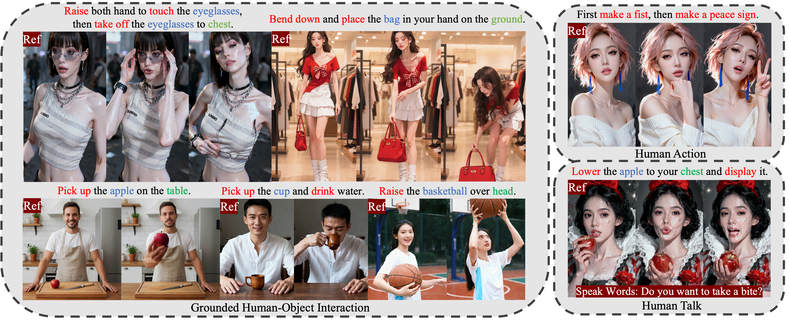
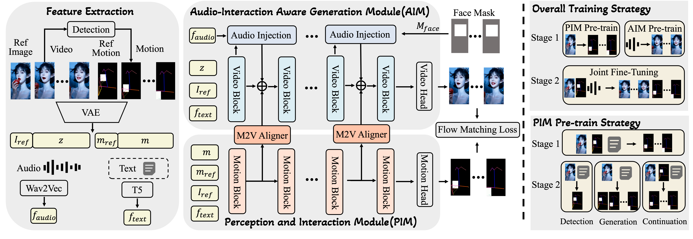
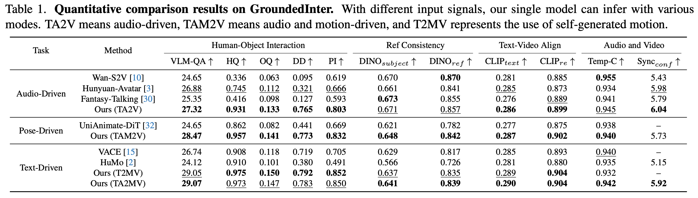

<div align="center">
   

# Making Avatars Interact <br> Towards Text-Driven Human-Object Interaction for Controllable Talking Avatars
<!-- # Towards Text-Driven Human-Object Interaction for Controllable Talking Avatars -->

</div>

**InteractAvatar** is a novel dual-stream DiT framework that enables talking avatars to perform **Grounded Human-Object Interaction (GHOI)**. Unlike previous methods restricted to simple gestures, our model can perceive the environment from a static reference image and generate complex, text-guided interactions with objects while maintaining high-fidelity lip synchronization.

<div align="center">
  <a href="https://github.com/angzong/InteractAvatar"></a> &ensp;
  <a href="https://interactavatar.github.io/"></a> &ensp;
  <a href="#"></a> &ensp;
  <a href="https://huggingface.co/youliang1233214/InteractAvatar"></a>
</div>

<br>



## 🔥🔥🔥 News!!

* **Jan 20, 2026**: 👋 We release the **InteractAvatar** paper and project page.
* **Jan 30, 2026**: 👋 We release the inference code.

## 📑 Open-source Plan

- [x] Paper and Project Page
- [x] Inference code
- [x] Pretrained Checkpoints (Initialised from Wan2.2-5B)
- [x] **GroundedInter** Benchmark Data

## 📋 Table of Contents

- [🔥🔥🔥 News!!](#-news)
- [📖 Abstract](#-abstract)
- [🏗️ Model Architecture](#-model-architecture)
- [📊 Performance](#-performance)
- [🎬 Case Show](#-case-show)
- [📜 Requirements](#-requirements)
- [🛠️ Installation](#-installation)
- [🧱 Download Models](#-download-models)
- [🚀 Inference](#-inference)
- [📝 Citation](#-citation)
- [🙏 Acknowledgements](#-acknowledgements)

## 📖 Abstract

Generating talking avatars that can interact with their environment remains an open challenge. Existing methods often struggle with the **Control-Quality Dilemma**, failing to ground actions in the scene or losing video fidelity when complex motions are required.

**InteractAvatar** introduces a dual-stream framework that explicitly decouples perception planning from video synthesis:
*   **Perception and Interaction Module (PIM):** Handles environmental perception and motion planning (detection & motion generation) based on the reference image and text prompts.
*   **Audio-Interaction Aware Generation Module (AIM):** Synthesizes vivid talking avatars performing object interactions, guided by PIM via a novel Motion-to-Video (M2V) aligner.

**Key advantages:**
- ✅ **Grounded Interaction:** Perceives static scenes and interacts with specific objects (e.g., "Pick up the apple on the table").
- ✅ **Multimodal Control:** Supports any combination of **Text**, **Audio**, and **Motion** inputs.
- ✅ **Mult-Scene Control:** Generate avatars that can **Talk**, **Act**, and **Interact with Object** inputs.
- ✅ **High Fidelity:** Parallel co-generation ensures plausible video quality and precise lip-sync.

## 🏗️ Model Architecture



Our framework consists of two parallel DiT streams:
1.  **PIM (Planning Brain):** Takes the reference image and text prompt to generate a structural motion sequence (skeletal poses + object bounding boxes). It uses a "Perception as Generation" training strategy.
2.  **AIM (Rendering Engine):** Takes the audio, reference image, and the motion features from PIM (injected via the **M2V Aligner**) to generate the final video frames.

## 📊 Performance

We evaluate on our proposed **GroundedInter** benchmark (400 images, 100+ object types). InteractAvatar significantly outperforms SOTA methods (HuMo, VACE, Wan-S2V, etc.) in both interaction quality and video consistency.




## 🛠️ Installation

1. **Clone the repository:**
   ```bash
   git clone https://github.com/angzong/InteractAvatar.git
   cd InteractAvatar
   ```

2. **Create a Conda environment:**
   ```bash
   conda create -n interact_avatar python=3.10
   conda activate interact_avatar
   ```

3. **Install dependencies:**
   ```bash
   pip install torch==2.6.0+cu124 torchvision==0.21.0+cu124 torchaudio==2.6.0 --index-url https://download.pytorch.org/whl/cu124
   pip install ninja psutil packaging
   pip install flash_attn==2.7.4.post1 --no-build-isolation
   conda install -c conda-forge librosa
   conda install -c conda-forge ffmpeg
   pip install -r requirements.txt
   ```

## 🧱 Download Models

| Model Component | Description | Download Link |
|-----------------|-------------|---------------|
| **InteractAvatar** | InteractAvatar model | [🤗 Huggingface](https://huggingface.co/youliang1233214/InteractAvatar/tree/main/interact-avatar) |
| **InteractAvatar-long** | InteractAvatar support for long video generation | [🤗 Huggingface](https://huggingface.co/youliang1233214/InteractAvatar/tree/main/interact-avatar-long) |
| **Wav2Vec 2.0** | Audio Feature Extractor | [🤗 Huggingface](https://huggingface.co/youliang1233214/InteractAvatar/tree/main/wav2vec2-base) |
| **Wan2.2-TI2V-5B** | Pretrained Video Model| [🤗 Huggingface](https://huggingface.co/Wan-AI/Wan2.2-TI2V-5B) |
| **GroundedInter** | GHOI-benchmark| [🤗 Huggingface](https://huggingface.co/youliang1233214/GroundedInter) |

Place the weights in the `./ckpt` directory.

## 🚀 Inference

You can generate videos using a reference image, an audio file, and a text prompt.

```bash
. test_inter_tia2mv_GPu_hoi.sh
```

**Key Parameters:**
- `mode`: Choise from 'a2mv', 'ap2v','mv', 'a2v', 'p2v' for audio-driven video-motion co-generation, audio-pose-driven generation, text-driven video-motion co-generation, audio-driven video generation and pose-driven video generation.
- `transformer_path`: .safetensor file dir. For long video generation, choise long-video-gen version with better id preservation.
- `test_data_path`: Test case json path, provide first frame ref img, action and interaction text prompt, optional audio or motion signal.
- `audio_guide_scale`: cfg scale for audio-sync, 7.5 by default.
- `text_guide_scale`: cfg scale for prompt following, 5 by default.
- `sample_steps`: inference denoising steps, 40 by default.
- `bad_cfg`: trick for visual quality imporvement, True by default.


## 📝 Citation

If you find **InteractAvatar** useful for your research, please cite our paper:

```bibtex
@article{interactavatar2026,
  title={Making Avatars Interact: Towards Text-Driven Human-Object Interaction for Controllable Talking Avatars},
  author={Anonymous},
  journal={CVPR Submission},
  year={2026}
}
```
## 🙏 Acknowledgements

We sincerely thank the contributors to the following projects:
- [Wan2.2](https://github.com/Wan-Video/Wan2.2)
- [HunyuanVideo](https://github.com/Tencent/HunyuanVideo)
- [Diffusers](https://github.com/huggingface/diffusers)
- [HuggingFace](https://huggingface.co)
- [DeepSpeed](https://github.com/deepspeedai/DeepSpeed)


---

<div align="center">
  
**Star ⭐ this repo if you find it helpful!**

</div>
